<p align="center">
    
    <h1 align="center">Quotient - Expense Tracker</h1>
</p>
<div align="center">

  

</div>
<div  align="center">
    <h2> Material design expense manager</h2>
    Originally forked from <a href="https://github.com/RetroMusicPlayer/Paisa">RetroMusicPlayer</a>
</div>

### Screen shots

#### Mobile

| 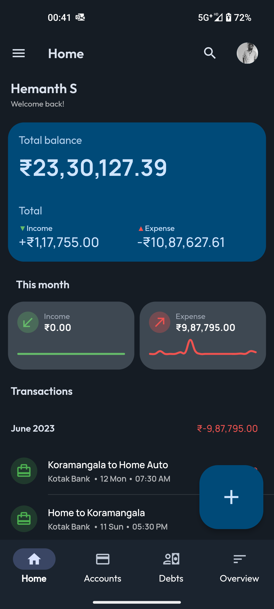 | 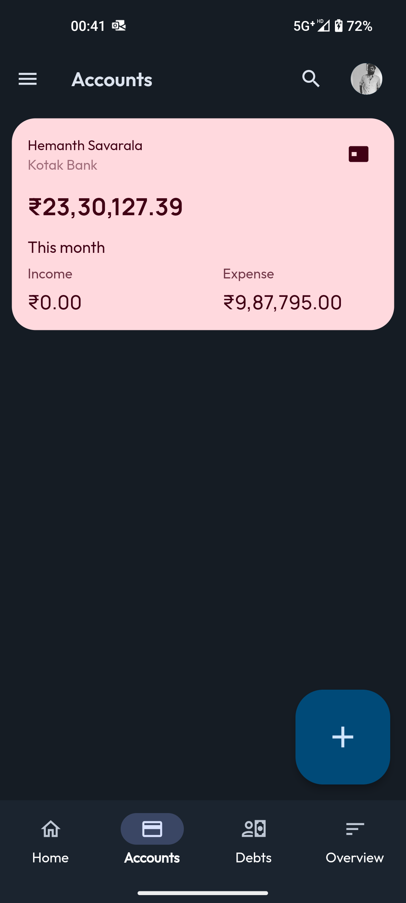 | 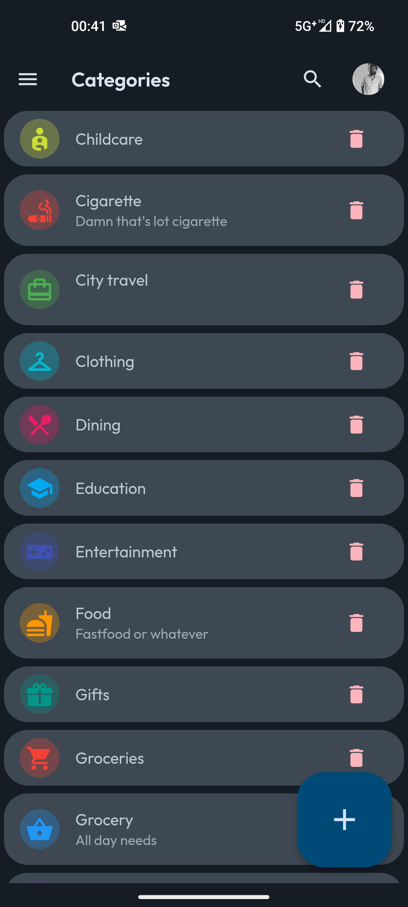 |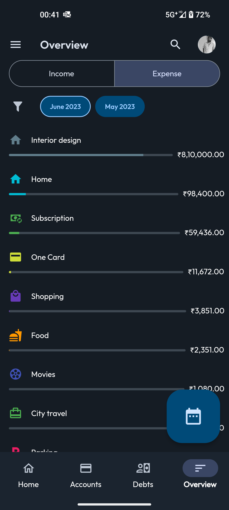 |
| :--: | :--: | :--: | :--: |
|Home|Accounts|Categories|Budget overview|

#### Foldable

| 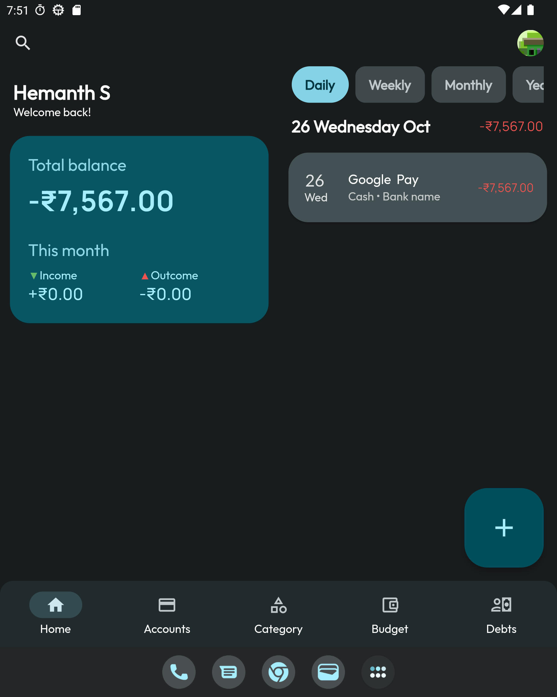 | 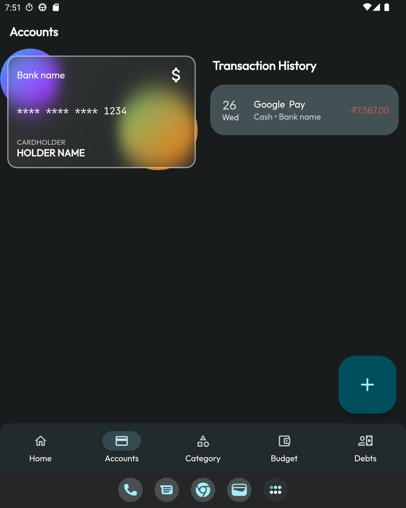 | 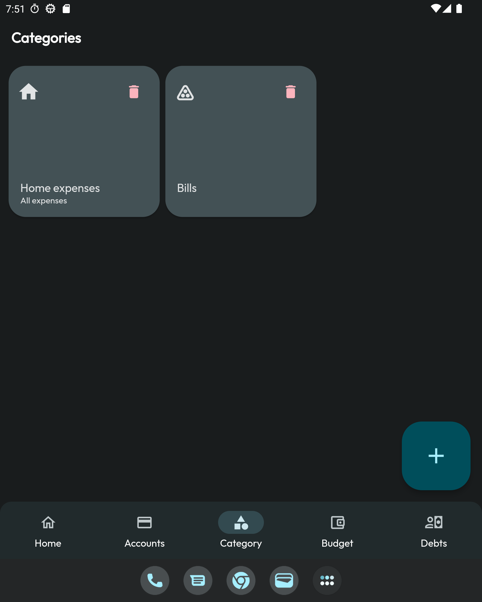 |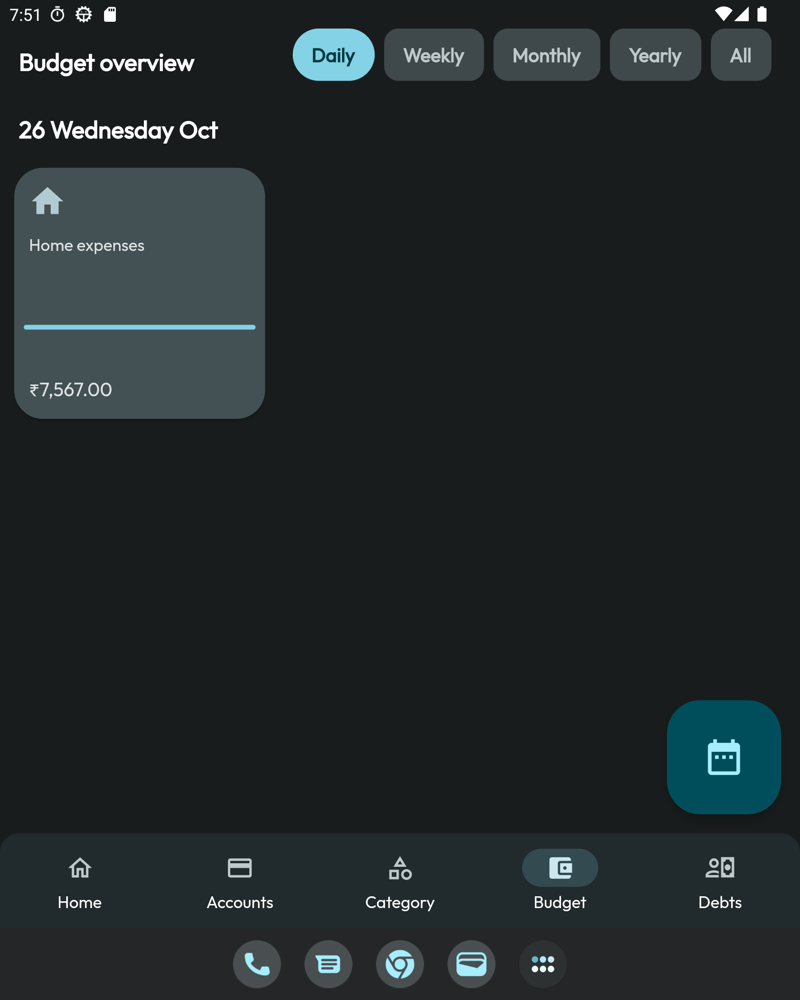 |
| :--: | :--: | :--: | :--: |
|Home|Accounts|Categories|Budget overview|

#### Tablet & Desktop

 | 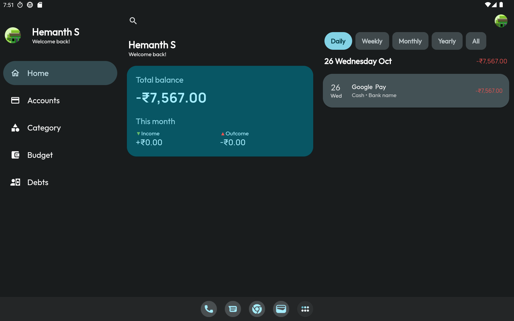 | 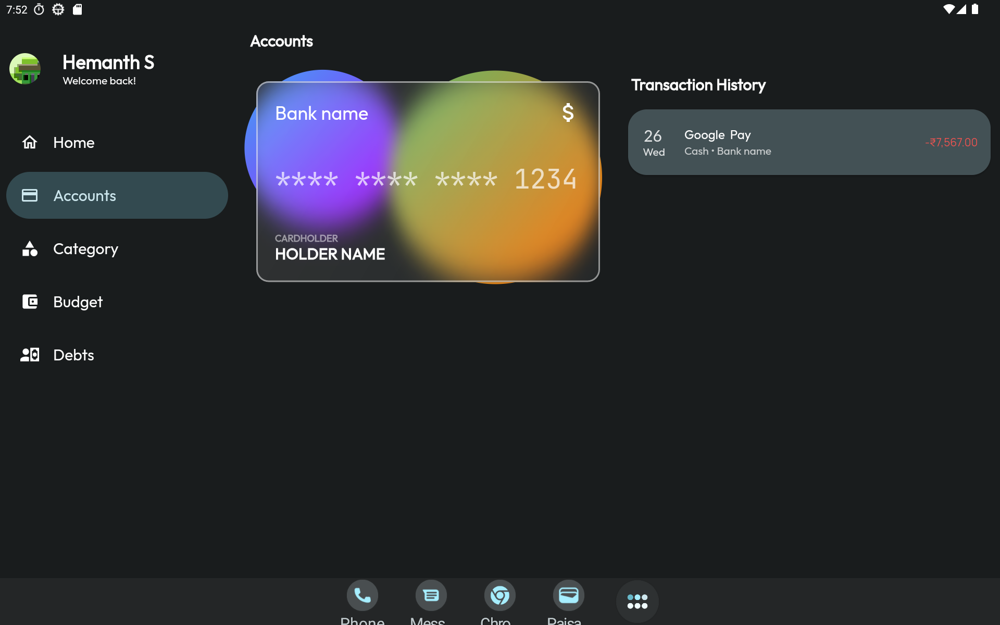 | 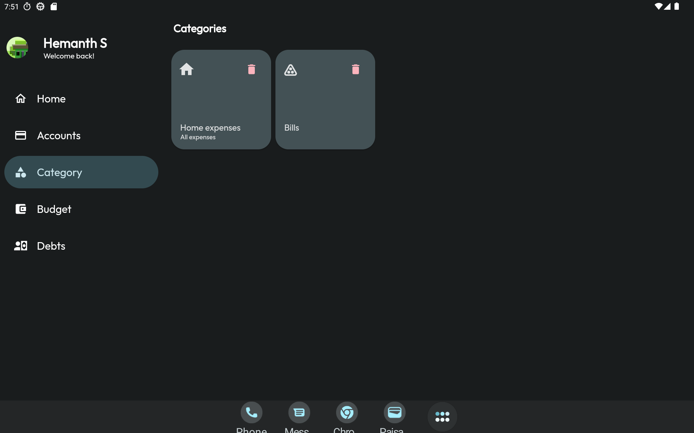 |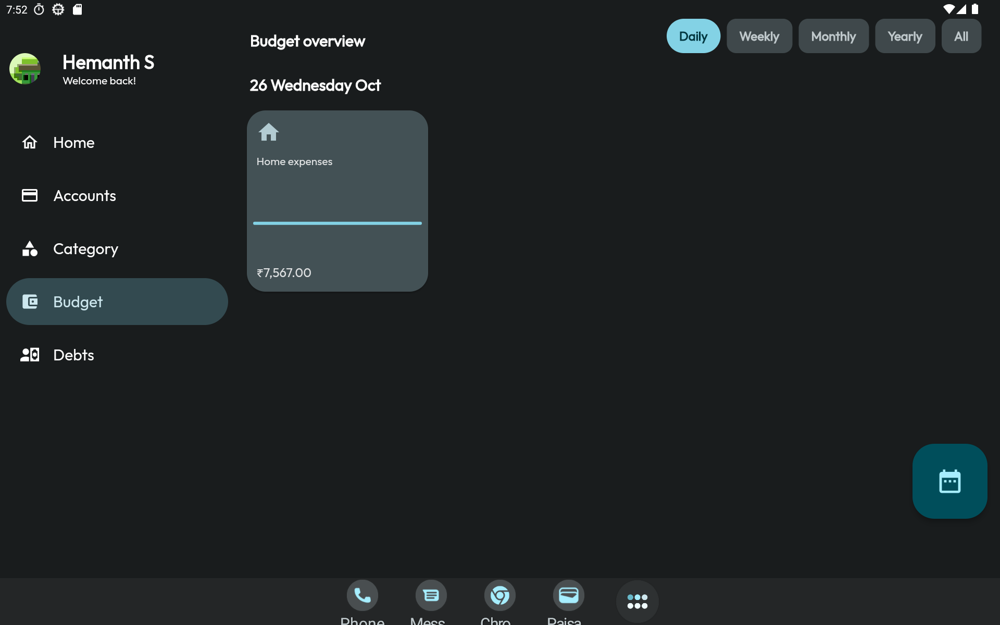 |
| :--: | :--: | :--: | :--: |
|Home|Accounts|Categories|Budget overview|

### Features

- Tracking expenses, incomes & deposits
- Account & budget wise overview
- Manage categories

### Contributing

[Check out the issue board](https://github.com/users/xunafay/projects/16/views/2)

All issues in the 'Ready' column are ready to be worked on. If you want to work on an issue, leave a comment on the issue and we will assign it to you.

### Steps to translate

1. Create `.arb` file inside `lib/localization/app_<language_code>.arb` example `app_en.arb`
2. Copy all transactions from `app_en.arb` to created file and remove all keys which annotates with `@`
   From

   ```json
   {
    "appTitle": "Quotient",
    "@appTitle": {
        "description": "The app name",
        "type": "text",
        "placeholders": {}
    }
   }
    ```

    To

    ```json
    {
      "appTitle": "Quotient"
    }
    ```

3. Run the app and check once

### Steps to build project
1. Clone the Flutter Project:
   * Use `git clone https://github.com/xunafay/Quotient.git` to download the project from the GitHub repository.
2. Install Dependencies:
   * Navigate to the project directory and run `flutter pub get` to install the required dependencies.
3. Build generated files:
   * Run `dart run build_runner build --delete-conflicting-outputs` to generate required files.
   * Run `flutter_rust_bridge_codegen generate --watch` to generate required rust bridge files and watch for changes.
4. Run the App:
   * Connect a device or emulator and run the app using `flutter run --flavor dev` or through your IDE.

### Download

Coming soon!

### License

```
This source code is licensed under the GPLv3-style license found in the
LICENSE file in the root directory of this source tree.
```
